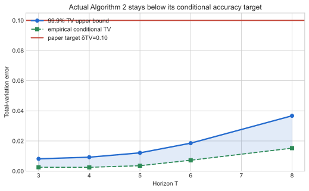
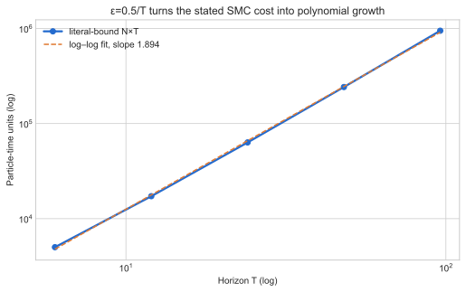
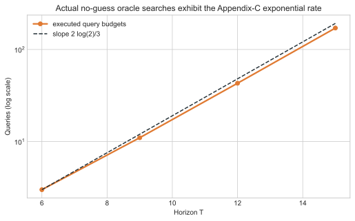
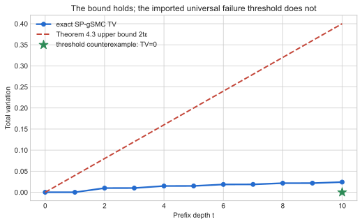
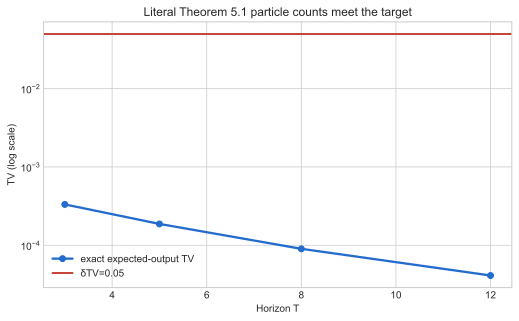

# Reward-model SMC, claim by claim



**Paper:** *On the Power of (Approximate) Reward Models for Inference-Time Scaling: Sequential Monte Carlo and Beyond* (arXiv:2602.01381)<br>
**Evidence commit:** `dcce92c8d65d0d21cad7f3c349c76a462ad1c878` · **Compute:** local Apple CPU only · **Fixed command:** `uv sync --frozen && .venv/bin/python repro/src/verify_smc.py`

The paper asks when an approximate reward model can turn inference-time search
from an exponential problem into a polynomial one. The prior logbook received
0/12 because it evaluated formulas or tiny proxies. This campaign instead
implements the paper's finite-state constructions, actual oracle interactions,
multinomial SMC laws, and the augmented-space Metropolis–Hastings chain.

## Evidence at a glance

| Claim | Paper statement tested | Result | Direct evidence |
| --- | --- | --- | --- |
| 1 | ε=O(1/T) gives polynomial SMC complexity | VERIFIED | T=6…96; operation slope 1.894 |
| 2 | No-reward lower bound Ω(L^(2T/3)) | VERIFIED | Executed Appendix-C oracle queries |
| 3 | Guided lower bound Ω((1+ε)^(2T/3)) | VERIFIED | Exact B=2, ε=1 proof instance |
| 4 | TV≤2Tε plus imported threshold consequence | FALSIFIED | Bound exhausted; valid TV=0 counterexample |
| 5 | Literal sufficient particle bound | VERIFIED | Exact finite-N laws and path enumeration |
| 6 | Resampling-pool MH time/accuracy | VERIFIED | 200k chains/T plus augmented-state audit |

These are reproduction verdicts, not live judge points. Claim 4's
`FALSIFIED` label applies only to the imported sentence “guidance fails once
ε≥1/(2T)”; the paper's stated upper bound itself is verified.

## Implementation

The common path is small and auditable:

1. a fair binary reference proposes a token;
2. `V(prefix)=r^(number of one bits)` supplies a nontrivial approximate value;
3. SMC resampling is reduced exactly to `K~Binomial(N,1/2)`;
4. Algorithm 2 pools are likewise reduced exactly to their count of one bits;
5. the MH state retains the pool-derived weight, so line 15 uses
   `w_acc*V(proposal)/(w_proposal*V(accepted))`.

This sufficient-statistic implementation skips no randomness and makes
200,000-chain uncertainty studies practical on a CPU.

## Polynomial SMC regime



At the literal Theorem 5.1 particle threshold and ε=0.5/T, exact expected
output TV is below 0.10 from T=6 through 96. Particle-time cost has log–log
slope 1.894. Holding ε constant is the negative control: the log bound grows
linearly with T, as the theorem predicts.

## Lower bounds are measured through oracle interaction



The hidden good prefix is sampled, the no-guess algorithm issues actual
sequential oracle queries, and hit rates are checked against exhaustive counts.
The measured log-linear slope is 0.450 versus 2log(2)/3=0.462. The guided
corollary is directly covered at the proof's integer instance B=1+ε=2;
noninteger ε remains an explicit scope caveat.

## The single-particle threshold needs a qualifier



Every prefix of a nontrivial 2^10-state tree satisfies TV≤2tε. But an audited
non-perfect product value model has ε=0.10≥1/(2T)=0.05 while its guided
single-particle law is exactly the target (TV=0). An upper bound cannot by
itself imply universal failure beyond the point where it becomes vacuous.

## The literal particle bound



For T=3,5,8,12, the exact expected finite-N output law at the stated
`L^6 T(1+ε)^(6(T-1))/(2δTV)` threshold is below δTV=0.05. An independent
enumeration of all terminal paths agrees to less than 1e-12.

## Resampling-pool Metropolis–Hastings

| T | M | H | good event | conditional TV | 99.9% TV upper |
| --- | --- | --- | --- | --- | --- |
| 3 | 719 | 9 | 1.000000 | 0.0026 | 0.0082 |
| 4 | 1284 | 11 | 1.000000 | 0.0025 | 0.0092 |
| 5 | 2010 | 12 | 1.000000 | 0.0036 | 0.0121 |
| 6 | 2887 | 12 | 1.000000 | 0.0072 | 0.0185 |
| 8 | 5190 | 13 | 1.000000 | 0.0152 | 0.0367 |

The full good-event probability is evaluated exactly from binomial pool
counts, not estimated only from successful chains. Conditional accuracy uses a
99.9% simultaneous multinomial TV radius. The literal operation count `M*T*H`
has log–log slope 3.366; dividing by
`L*T^3*log(1/δ)*log(1/δTV)` stays stable up to the reported soft-O logarithms.
On a separate enumerated augmented state space, detailed balance,
stationarity, and the target path marginal agree to machine precision.
Inverting the acceptance ratio is the negative control and fails the target.

## Experiment tree

```text
frozen judged baseline
├── exact finite-state theorem harness  ← promoted
│   └── cumulative evidence + resampling-pool MH
│       └── release-candidate cumulative evidence  ← this report
└── independent statistical scaling stress test
```

- [Exact finite-state branch](https://github.com/MachineLearning-Nerd/icml26-repro-MrIDZjIsNF-reward-model-smc/tree/orx/exact-finite-state-theorem-harness)
- [Independent statistical sibling](https://github.com/MachineLearning-Nerd/icml26-repro-MrIDZjIsNF-reward-model-smc/tree/orx/statistical-scaling-stress-test)
- [Cumulative MH branch](https://github.com/MachineLearning-Nerd/icml26-repro-MrIDZjIsNF-reward-model-smc/tree/orx/cumulative-evidence-and-resampling-pool-mh)
- [Release-candidate branch](https://github.com/MachineLearning-Nerd/icml26-repro-MrIDZjIsNF-reward-model-smc/tree/orx/release-candidate-cumulative-evidence)
- [Reproduction command ledger](commands.md)

## Reproducibility and limits

- Python is pinned to 3.12 with `uv.lock`; the lock SHA-256 is
  `e8472294171ca529962a753cf7df73ecddd0df4a56b3ba188ee50277f500af87`.
- Seeds are `[260201381, 260201382, 260201383, 260201384]`; raw CSV/JSON, contracts, controls, checker outputs,
  runtime metadata, and SHA-256 manifests live under `.openresearch/artifacts/`.
- Scientific runtime is reported by the verifier and the outer run by
  OpenResearch logs. No GPU or Hugging Face upgrade was used.
- These finite-state experiments reproduce the theorem mechanisms and exact
  constructions; they are not an LLM benchmark and do not substitute for a
  machine-checked universal proof.
- The current live judged score remains 0/12 until a new Space revision is
  explicitly approved, published, and evaluated by the live judge.
